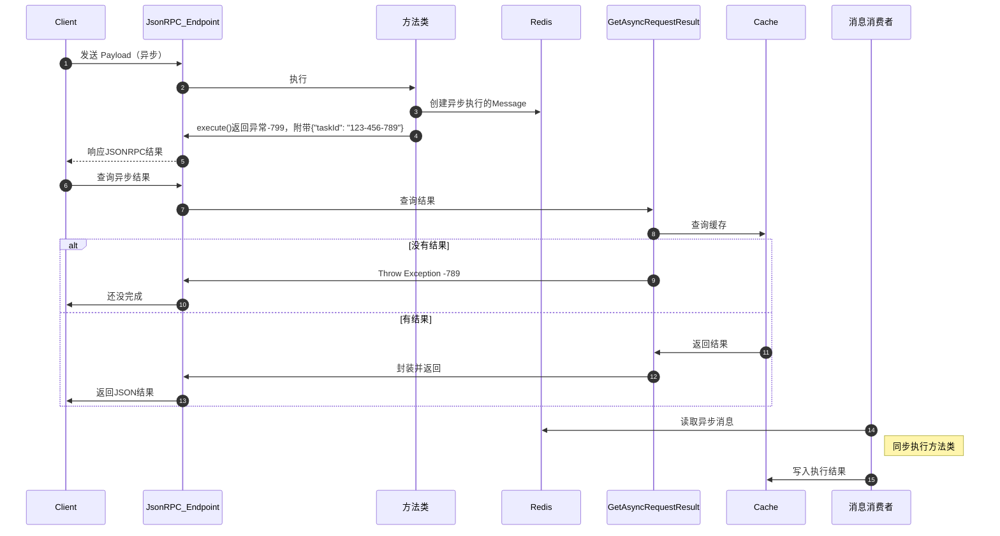

# Mermaid 工作流程图

```mermaid
sequenceDiagram
autonumber
Client->>JsonRPC_Endpoint: 发送 Payload（异步）
JsonRPC_Endpoint->>方法类: 执行
方法类->>Redis: 创建异步执行的Message
方法类->>JsonRPC_Endpoint: execute()返回异常-799，附带{"taskId": "123-456-789"}
JsonRPC_Endpoint-->>Client: 响应JSONRPC结果

Client->>JsonRPC_Endpoint: 查询异步结果
JsonRPC_Endpoint->>GetAsyncRequestResult: 查询结果
GetAsyncRequestResult->>Cache: 查询缓存
alt 没有结果
    GetAsyncRequestResult->>JsonRPC_Endpoint: Throw Exception -789
    JsonRPC_Endpoint->>Client: 还没完成
else 有结果
    Cache->>GetAsyncRequestResult: 返回结果
    GetAsyncRequestResult->>JsonRPC_Endpoint: 封装并返回
    JsonRPC_Endpoint->>Client: 返回JSON结果
end

消息消费者->>Redis: 读取异步消息
Note right of 消息消费者: 同步执行方法类
消息消费者->>Cache: 写入执行结果
```
